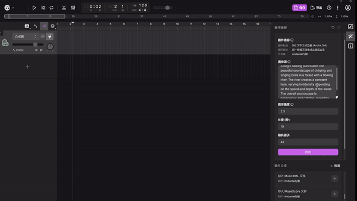
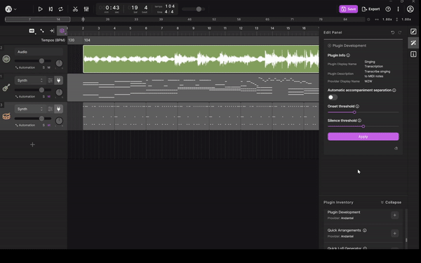
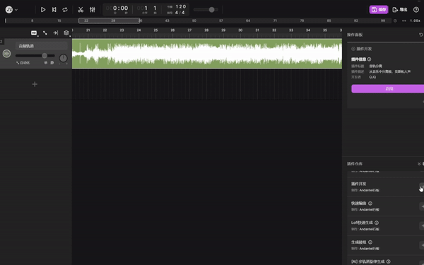
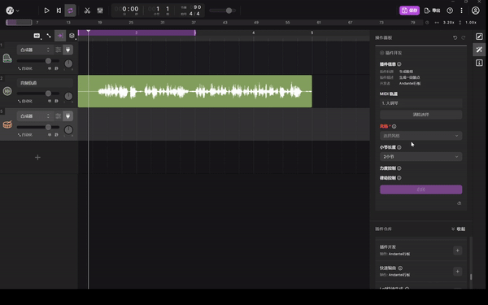

# TuneFlow Python SDK

[English](./README.md) | [简体中文](./README.zh.md)


[](https://dev.azure.com/zeostudio/tuneflow-public/_build/latest?definitionId=32&branchName=main)
[](https://dev.azure.com/zeostudio/tuneflow-public/_build/latest?definitionId=32&branchName=main)
[](https://pypi.org/project/tuneflow-py/)
[](https://discord.com/channels/1076012137161424906/1076012755250851860)


## What is `TuneFlow` and `tuneflow-py`?

[TuneFlow](https://www.tuneflow.com) is a next-gen DAW that aims to boost music making productivity through the power of AI. Unlike traditional DAWs, TuneFlow has a plugin system designed to facilitate music production in almost all areas, including but not limited to **song writing**, **arrangement**, **automation**, **mixing**, **transcription**...... You can easily write your own algorithms or integrate your AI models directly into the song-making process. `tuneflow-py` is the Python SDK of TuneFlow plugins.

## Installation

```bash
pip install tuneflow-py
```

## Prefer another language?

Check out the SDKs in other languages:

- **Typescript**: https://www.github.com/tuneflow/tuneflow
- Other: Contributions welcome!

## Why `tuneflow-py`?

The core idea of TuneFlow's plugin system is that you only care about the data model, NOT the implementation. A plugin's only goal is to modify the song, and the DAW will apply the changes automatically.

Unlike traditional DAW plugins where you can only process MIDI/audio signals from one track, this plugin system allows you to access and modify any part of the project, which is perfect for integrating complex algorithms and AI models.

What's more exciting is that this execution model allows remote processing, which means you can write and test your plugin locally and deploy it anywhere you like, and the DAW can run your plugin through simple network requests.

Below is an illustration of the plugin execution flow:


## Getting Started

Visit [https://help.tuneflow.com/en/developer](https://help.tuneflow.com/en/developer) for developer documentation.

## Examples

### ⌨️ AudioLDM

Generate speech, sound effects, music and more from text prompt.

Repo: https://github.com/tuneflow/AudioLDM



### 🎙️ Singing Transcription

Transcribe a singing vocal from audio to MIDI. Works with background noise or music.

Repo: https://github.com/tuneflow/singing-transcription-plugin



### ✂️ Demucs

Separate a raw music audio clip into vocal, drums, bass and others.

Repo：https://github.com/tuneflow/tuneflow-plugin-demucs



### 🥁 Pocket Drum

Generate a drum pattern with the given style and optionally a melody midi.

Repo: To be updated.



For a comprehensive of example plugins, check out https://www.github.com/tuneflow/tuneflow-py-demos

## Contribute

Checkout [contribution guidelines](./CONTRIBUTE.md).

## Resources

[TuneFlow Website](https://tuneflow.com)

[Typescript SDK](https://www.github.com/tuneflow/tuneflow)
