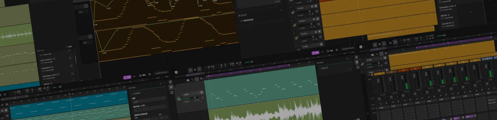
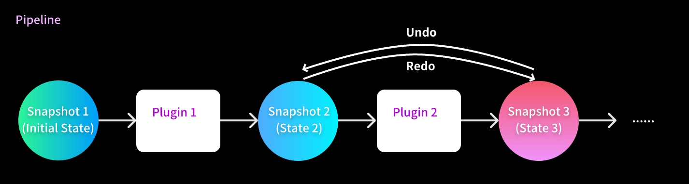

# TuneFlow Python SDK



[](https://dev.azure.com/zeostudio/tuneflow-public/_build/latest?definitionId=32&branchName=main)
[](https://dev.azure.com/zeostudio/tuneflow-public/_build/latest?definitionId=32&branchName=main)
[](https://pypi.org/project/tuneflow-py/)
[](https://discord.com/channels/1076012137161424906/1076012755250851860)


## What is `TuneFlow` and `tuneflow-py`?

[TuneFlow](https://www.tuneflow.com) is a next-gen DAW that aims to boost music making productivity through the power of AI. Unlike traditional DAWs, TuneFlow has a plugin system designed to facilitate music production in almost all areas, including but not limited to **song writing**, **arrangement**, **automation**, **mixing**, **transcription**...... You can easily write your own algorithms or integrate your AI models directly into the song-making process. `tuneflow-py` is the Python SDK of TuneFlow plugins.

## Installation

```bash
pip install tuneflow-py
```

## Prefer another language?

Check out the SDKs in other languages:

- **Typescript**: https://www.github.com/tuneflow/tuneflow
- Other: Contributions welcome!

## Getting started

The core idea of TuneFlow's plugin system is that you only care about the data model, NOT the implementation. A plugin's only goal is to modify the song, and the DAW will get the modified result and apply changes automatically. Below is an illustration:



A barebone plugin may look like this:

```python
from tuneflow_py import TuneflowPlugin, Song, ReadAPIs, ParamDescriptor


class HelloWorld(TuneflowPlugin):
    @staticmethod
    def provider_id():
        return "andantei"

    @staticmethod
    def plugin_id():
        return "hello-world"

    @staticmethod
    def provider_display_name():
        return "Andantei"

    @staticmethod
    def plugin_display_name():
        return "Hellow World"

    def params(self) -> dict[str, ParamDescriptor]:
        return {}

    def init(self, song: Song, read_apis: ReadAPIs):
        pass

    def run(self, song: Song, params: dict[str, Any], read_apis: ReadAPIs):
        print("Hello World!")

```

When writing a plugin, our main focus is in `params`, `init` and `run`.

### `params`

This is where you specify the input parameters you want from the user or from the DAW. It will be processed by the DAW and generate your plugin's UI widgets.

### `init`

Called by the DAW when the user loads the plugin but before actually running it. The DAW will provide the current song snapshot (`song: Song`) and some read-only APIs (`read_apis: ReadAPIs`), and you will take these params to initialize your plugin.

For example, if you have a list of presets that applies to different time signatures, you can use `init` to read the current song's time signature and filter out those options that don't work for the song.

### `run`

Called by the DAW when the user actually runs the plugin by hitting the **Apply`** button.

Here is where you implement your main logic. The method takes in the current song snapshot (`song: Song`), the params that are actually provided by the user or the DAW (`params`), and the read-only APIs (`read_apis: ReadAPIs`).

## Run your plugin

To debug and run your plugin locally, you can use `tuneflow-devkit-py`. For more documentation, visit: https://github.com/tuneflow/tuneflow-devkit-py

## Examples

For a comprehensive of example plugins, check out https://www.github.com/tuneflow/tuneflow-py-demos

## Contribute

Checkout [contribution guidelines](./CONTRIBUTE.md).

## Resources

[TuneFlow Website](https://tuneflow.com)

[Typescript SDK](https://www.github.com/tuneflow/tuneflow)
